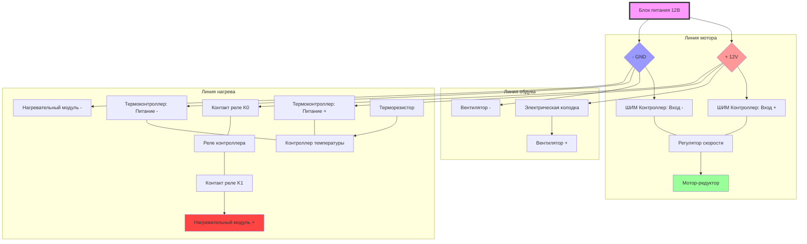

# Электрическая схема соединений станка

## 1. Входная цепь (Сетевое напряжение 220В)

- Питание: Сетевой кабель C7 → Гнездо C8 на корпусе.
- Защита и разрыв: От гнезда C8 фазный провод идет на Тумблер (кнопку).
- Распределение: После кнопки провода (L и N) идут на Первую колодку (входную). К ней подключается вход вашего Блока Питания (БП) 12В.

## 2. Низковольтный блок (12В) — Распределение через клеммы

Выход с Блока Питания (+12В и -12В) подается на Вторую колодку (шину питания). Отсюда ток расходится на три узла:

А. Узел протяжки (Линия мотора):

1.  От 12В-колодки питание идет на вход ШИМ (PWM) контроллера (контакты Power+ / Power-).
2.  Выход ШИМ-контроллера (Motor+ / Motor-) подключается напрямую к Червячному мотор-редуктору.
3.  Примечание: Если вал крутится не в ту сторону, просто поменяйте провода мотора местами.

Б. Узел охлаждения:

1.  Вентилятор 40х40 подключается напрямую к 12В-колодке. Он должен работать постоянно при включении станка для охлаждения электроники и предотвращения расплавления корпуса.

В. Узел нагрева (Линия термостата):

1.  Питание 12В с колодки подается на контакты питания Контроллера температуры H50TR.
2.  Датчик температуры (Термистор NTC 100K) подключается в выделенный разъем на контроллере.
3.  Нагревательный блок: Один провод нагревателя идет к «+12В» на колодке, а второй — через Реле (выходные контакты) контроллера температуры к «-12В» (GND). Это позволит контроллеру разрывать цепь при достижении нужной температуры.
